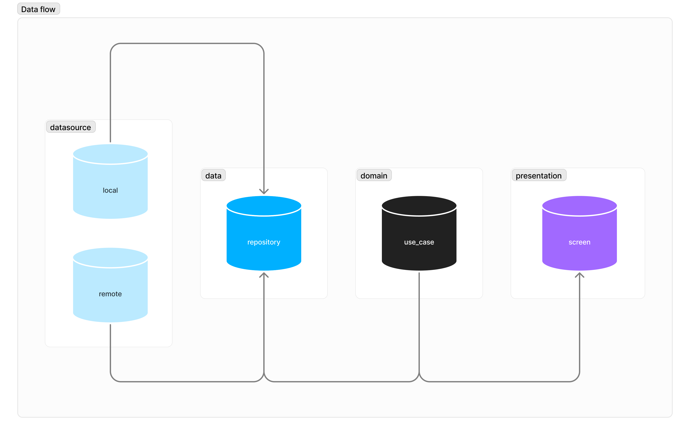

# Daniel's Resume

The purpose of this project is to server as a sample for implementing apps.
In terms of base functionality, it simply displays my personal Resume.
However, it is designed to be easily extended to include various code samples that will be continuously added and maintained.
Hopefully, this will serve as a good reference for anyone looking to learn more about the technologies used in it.

## Design

The app is designed to be as simple as possible, with a clean and modern look, following the Material Design 3 guidelines.
The original design is [available on Figma](https://www.figma.com/file/NF9oVXWUyTO3EK4C9M6lWK/resume?type=design&node-id=0%3A1&mode=design&t=ImrfHWWkkxywyrRI-1).

## Architecture

The implementation is based on the [MVI (Model-View-Intent) pattern](https://proandroiddev.com/mvi-architecture-with-kotlin-flows-and-channels-d36820b2028d) architecture and follows as best as possible the [Clean Architecture](https://blog.cleancoder.com/uncle-bob/2012/08/13/the-clean-architecture.html) and [SOLID](https://en.wikipedia.org/wiki/SOLID) principles.

## Frameworks:

- [x] [Android Native](https://developer.android.com/)
- [ ] [iOS](https://developer.apple.com/ios/)
- [ ] [Kotlin multiplatform](https://kotlinlang.org/docs/multiplatform.html)
- [ ] [Flutter](https://flutter.dev/)
- [ ] [React Native](https://reactnative.dev/)
- [ ] [Svelte](https://svelte.dev/)

## Final considerations

This project is a work in progress and will be continuously updated with new features and improvements. Please feel free to get in touch if you have any questions or suggestions through my [LinkedIn](https://www.linkedin.com/in/danielleitelima) or [e-mail](mailto:limaleite.daniel@gmail.com?subject=Let's+talk).
