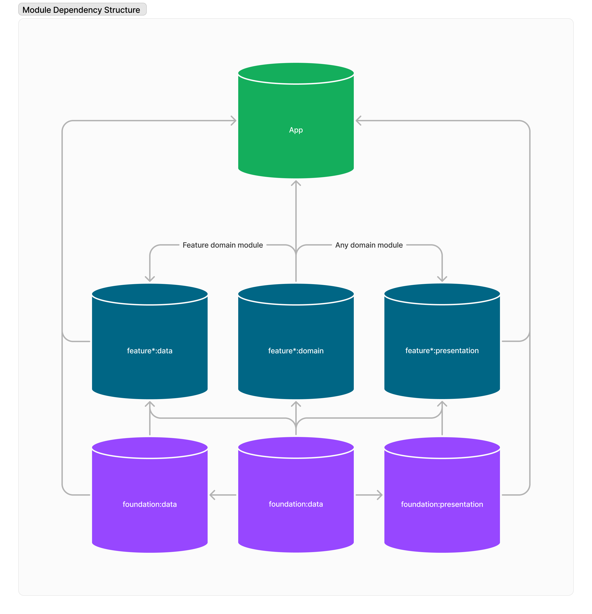

# App module

This module servers as the main entry point for the app, containing the main activity with it's view model as well as the Application class.
It will have as it's dependencies the `features` and `foundation` modules, operating as a wrapper for the whole app.

