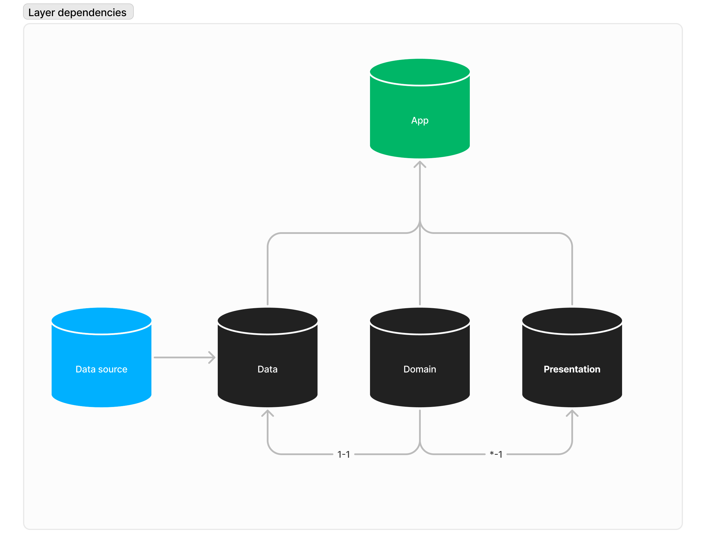

## Architecture
The **Resume App** is build following some core principles of [Clean Architecture](https://blog.cleancoder.com/uncle-bob/2012/08/13/the-clean-architecture.html) and [MVI (Model-View-Intent) pattern](https://proandroiddev.com/mvi-architecture-with-kotlin-flows-and-channels-d36820b2028d). It is divided into 3 main layers:

- Presentation: Contains the UI and manages the user interactions.
- Domain: Holds the business logic of the application.
- Data: Manages local and remote data sources.

## Design

The app was designed following the [Material Design 3](https://m3.material.io/) guidelines.
In addition, It supports dynamic theming and dark mode. You can check out the original design [here](https://www.figma.com/file/NF9oVXWUyTO3EK4C9M6lWK/resume)